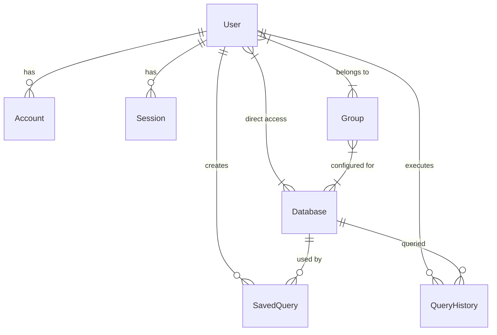

# Database Schema & Queries

This guide explains the data structure of QueryX and provides useful SQL queries for administration and maintenance.

## Core Schema Overview

QueryX uses PostgreSQL as its primary metadata store, managed via Prisma ORM.



## Table Definitions

### 1. `User`
Stores application users, their roles, and credentials.
- **Use**: Authentication and authorization.
- **Query**: `SELECT * FROM "User";`

### 2. `Database`
Stores connection metadata for the external databases that users want to query.
- **Use**: Managing connections to PostgreSQL, MySQL, etc.
- **Query**: `SELECT id, name, host, type, "isLocked" FROM "Database";`

### 3. `Group`
Logical containers for users and databases.
- **Use**: Bulk permission management (e.g., "Dev Team" can access "Staging DB").
- **Query**: `SELECT * FROM "Group";`

### 4. `QueryHistory`
Audit logs of every SQL query executed through the platform.
- **Use**: Security auditing, performance monitoring, and compliance.
- **Query**: `SELECT * FROM "QueryHistory" ORDER BY "createdAt" DESC LIMIT 10;`

### 5. `SavedQuery`
Snippets of SQL saved by users for future use.
- **Use**: Productivity feature for frequent queries.
- **Query**: `SELECT name, sql FROM "SavedQuery" WHERE "userId" = '...';`

---

## Useful SQL Queries

### Security & Auditing

**See recently executed queries by user:**
```sql
SELECT u.email, q.sql, q.status, q."executionTime"
FROM "QueryHistory" q
JOIN "User" u ON q."userId" = u.id
ORDER BY q."createdAt" DESC
LIMIT 50;
```

**Find all users with ADMIN privileges:**
```sql
SELECT name, email FROM "User" WHERE role = 'ADMIN';
```

**Check which users are currently inactive/locked:**
```sql
SELECT email, name FROM "User" WHERE "isActive" = false;
```

### Maintenance

**Count total queries executed per database:**
```sql
SELECT d.name, COUNT(q.id) as total_queries
FROM "Database" d
LEFT JOIN "QueryHistory" q ON d.id = q."databaseId"
GROUP BY d.name;
```

**Delete query history older than 30 days:**
```sql
DELETE FROM "QueryHistory" WHERE "createdAt" < NOW() - INTERVAL '30 days';
```

---

> [!IMPORTANT]
> Because the schema is generated by Prisma, table names are **Case Sensitive**. You must wrap them in double quotes (e.g., `"User"`, `"QueryHistory"`) when running manual SQL queries via `psql`.
